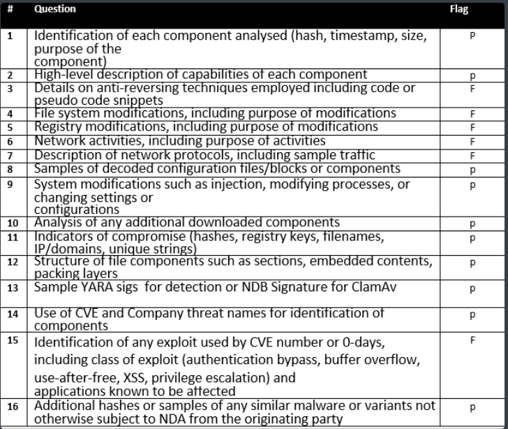

## Osiris Tactical+ Intelligence Report

### Analyst Checklist


## Identification


### Osiris Artifacts


## Osiris Overview

**Osiris is the Egyptian god of rebirth.**


Osiris is an extremely stealthy Banking trojan targeting victims in Poland , Germany and Japan. 

It has been retooled from the old banking trojan named **Kronos** “that was discovered in last 2014”
new Osiris Using  uncommon techniques in its injection routine **“Process Doppelgänging”**
To inject its final shellcode in **Wermgr.exe**. 

It hashes every loaded module also uses manual loading to load some dlls like ntdll.dll to bypass any security products hooks on these libs “Load a Clean file from ntdll” :

* Open Ntdll.dll as a File 


* Create Section and map the Ntdll File to its process memory Using MapViewOfSection Api


Good indicator of Osiris is  Process Doppelganging that uses a handle type of **TmTx** Created from the **NtCreateTransaction** API in the Handles Section

## Targeted Countries

Osiris has a major focus on **three** countries **Germany, Poland and Japan** it targets a lot individuals in Germany and 

about *five* financial institutions in Germany , plus *thirteen* Japanese financial institutions  and a lot of Poland financial institutions


## Targeted Industries


## Infection vector

Osiris has been distributed through multiple means including the following:

>>* Word 2017 Exploit Equation editor ((CVE-2017-11882))
>>* spam email
>>* Microsoft Word documents/RTF attachments with macro/OLE 
>>* Downloaded by loader malware (loader may also be delivered through exploit kit)

## Injection Technique

Osiris doesn’t use the standard Doppelganging technique instead it uses its custom implementation

**How Standard Process Doppelgänging work ?**
1. Transact
   
>* Creating a TxF transaction with a legitimate exe 
>* OverWrite the Legitimate exe with the Malicious code
>* All these changes only happen in the transaction Container and visible only on it

```cpp
// 1- Create Transaction

HANDLE hTransaction=CreateTransaction(NULL,0,0,0,INFINITE,0);

if (INVALID_HANDLE_VALUE==hTransaction)
    return -1;

// 2- Open File in the Transaction Scope

HANDLE hTransactedFile=CreateFileTransacted(TEXT("Path\\To\\Any\\Clean\\Executable.exe"), // legitimate exe

FILE_APPEND_DATA, // Open with writing acess
FILE_SHARE_READ, //  mutible readers
NULL, // no security attributes
OPEN_ALWAYS, // alway open or Create
FILE_ATTRIBUTE_NORMAL, // normal file
NULL, // no attr
hTransaction, // the above transaction handle
NULL, //  no mini version 
NULL); // reserved 

//3- OverWrite the legitimate executable
char buf[Malicious_executable_bytes];

DWORD dwWrittenBytes{0};

WriteFile(hTransactedFile,_countof(buf),&dwWrittenBytes,NULL);


```

2. Load
>* Create a shared Section of memory
>* Load the malicious exe to it
```cpp
//4- CreateSection

  // Resolving the address of NtCreateSection

using myNtCreateSection = NTSTATUS(NTAPI*)(OUT PHANDLE SectionHandle, IN ULONG DesiredAccess, IN POBJECT_ATTRIBUTES ObjectAttributes OPTIONAL, IN PLARGE_INTEGER MaximumSize OPTIONAL, IN ULONG PageAttributess, IN ULONG SectionAttributes, IN HANDLE FileHandle OPTIONAL);

myNtCreateSection fNtCreateSection = (myNtCreateSection)(GetProcAddress(GetModuleHandleA("ntdll"), "NtCreateSection"));

//5- CreateSection from the above transacated file "Malicious exe"

HANDLE sectionHandle = NULL; 

fNtCreateSection(&sectionHandle, SECTION_MAP_READ | SECTION_MAP_WRITE | SECTION_MAP_EXECUTE, NULL, (PLARGE_INTEGER)&sectionSize, PAGE_EXECUTE_READWRITE, SEC_COMMIT, hTransactedFile);


```

3. Rollback

>* Removing the malicious exe from the legitimate Process
So there is no malicious Files in the desk , no Artifacts , Nothing Can AVs detect


```cpp

//6- RollBack the transaction

RollbackTransaction(hTransaction);

```


4.	Animate
>* Create process and thread objects
>* Create process parameters
>* Copy parameters to the newly created process's address space
>* Resume the process

```cpp
ionHandle, NULL, NULL, FALSE);

// Resolving CreateProcessParameterEx
RtlCreateProcessParametersEx createProcessParametersEx = (RtlCreateProcessParametersEx)GetProcAddress(hNtdll, "RtlCreateProcessParametersEx");

my_PRTL_USER_PROCESS_PARAMETERS ProcessParams = 0;
UNICODE_STRING  string;

createProcessParametersEx(&ProcessParams, &string,NULL,NULL,&string,NULL,NULL,NULL,NULL,NULL, RTL_USER_PROC_PARAMS_NORMALIZED);

```

## Unpacking

### Osiris Custom Injection

* Osiris starts by Creating a process from **wermgr.exe** “outside the **scope of Transaction**” the Transaction doesn’t Created yet. Also open a file from wermgr executable  and Create a section from it into Osiris process so it can query some process information


 Create Transaction TmTx 

* Create Liebert.bmb file at tmp path in the TmTx Scope using **NtCreateFileTransaction , NtCreateFile ,RtlSetCurrentTransaction**


* Write Malicious executable Into bmb File and Creating a section from this file


* MapViewOfSection from the bmb Section into the wermgr.exe Process


* Change the protection of the entrypoint of wermgr.exe process to point to the Mapped section “malicious bmb Section” using **ZwProtectVirtualMemory**

>First parameter = wermgr.exe handle
Second =BaseAddress
Third = NumberOfByteToChangeProtection
Fourth = NewProtection
Fifth = OldOne


* Wermgr.exe after overwritten the entry point 


* New entry point written to wermgr.exe


* Finally Resume the Wermgr.exe 
### Useful APIs when tracking Doppelgänging

>NtCreateTransaction
NtCommitTransaction
NtRollbackTransaction
CreateFileTransacted
DeleteFileTransacted
RemoveDirectoryTransacted
MoveFileTransacted
RtlSetCurrentTransaction

## Comparison Starndard Injection & Osiris


### Module Hashes


## Indicators of Compromise (IOCs)

```python
•	hxxp://lionoi.adygeya[.]su
•	hxxp://milliaoin[.]info
•	hxxp://fritsy83[.]website/Osiris.exe
•	hxxp://oo00mika84[.]website/Osiris_jmjp_auto2_noinj.exe
•	http://jhrppbnh4d674kzh[.]onion/kpanel/connect.php
•	https://dkb-agbs[.]com/25062018.exe
•	https://startupbulawayo[.]website/d03ohi2e3232/
•	http://envirodry[.]ca
•	http://lionoi.adygeya[.]su
•	http://milliaoin[.]info
•	http://jmjp2l7yqgaj5xvv[.]onion/kpanel/connect.php
•	http[:]//jmjp2l7yqgaj5xvv[.]onion/kpanel/connect.php (Old Kronos)
•	http://mysit[.]space/123//v/0jLHzUW.


### Refrence

https://threatpost.com/kronos-banking-trojan-resurfaces-after-years-of-silence/134364/
```

## Yara

```js

rule win_kronos_auto {

    meta:
        author = "Felix Bilstein - yara-signator at cocacoding dot com"
        date   = "20/11/2020" 


    strings:
        

        $path_0 = { 8bf8 59 85ff 7439 53 6a00 }


        $path_1 = { 8bf0 e8???????? 8d4dd0 e8???????? 8bce 8d75c0 }


        $path_2= { 50 e8???????? 59 85c0 7509 85db 7d02 }


        $path_3 = { 85c0 7504 33db eb3d 8bcf e8???????? 8bf0 }

        
        $path_4 = { 6aff 56 8bf8 ff15???????? 56 ff15???????? 53 }

        $path_5 = { 8bcb ffd2 8b08 8b5804 8b5008 8b4508 53 }

        $path_6 = { 6a00 8d450c 50 ff7508 e8???????? 85c0 7d04 }


    condition:
        5 of them and filesize < 1293678
}

```
